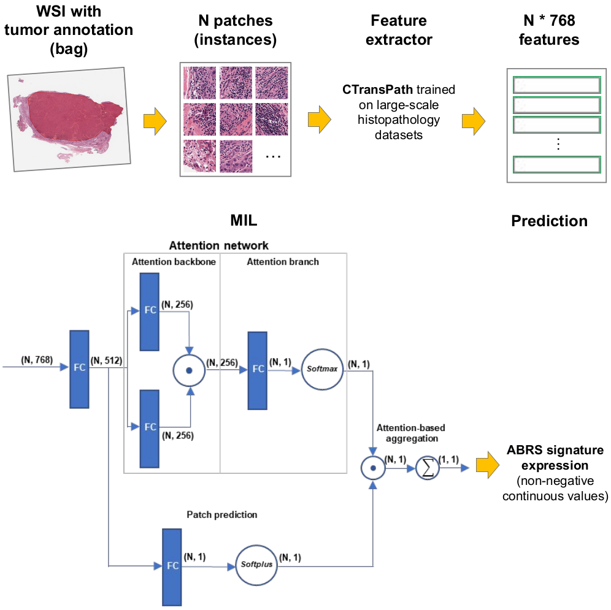

# ABRS-P: deep learning predicts sensitivity to atezolizumab-bevacizumab from digital slides of liver cancer

**Abstract**

Biomarkers of sensitivity to targeted systemic therapies are key to improving the clinical management of patients. Gene signatures have been developed to this aim, however they remain very challenging to implement into clinical practice. Here, we develop a regression deep-learning model able to estimate, directly from digital histological slides, the expression of a gene signature linked to sensitivity to atezolimab-bevacizumab, the standard of care for advanced liver cancer. We further show that the model predicts progression-free survival in a multicentric series of treated patients. Integration of heat-maps obtained by deep learning and spatial transcriptomics finally confirms that the model recognizes areas with high expression of the signature and other immune related genes. This approach paves the way for the development of inexpensive biomarkers for targeted and immune therapies that could easily be implemented in clinical practice. 

<p align="center">
  
</p>

**Installation**

OS: Linux (Tested on Ubuntu 18.04) 

Configure [conda env](docs/ABRS-P.yml) and 

Install the modified [timm](https://drive.google.com/file/d/1JV7aj9rKqGedXY1TdDfi3dP07022hcgZ/view?usp=sharing) library
```bash
pip install timm-0.5.4.tar
```

Download [CTransPath](https://drive.google.com/file/d/1DoDx_70_TLj98gTf6YTXnu4tFhsFocDX/view?usp=sharing) to the main directory as frozen feature extractor


**More info**

[Tutorial](docs/tutorial.md)


These codes are partially based on [CLAM](https://github.com/mahmoodlab/CLAM), [CTransPath](https://github.com/Xiyue-Wang/TransPath) and [Meylan et al. 2022](https://github.com/maximemeylan/Meylan_et_al_2022).
